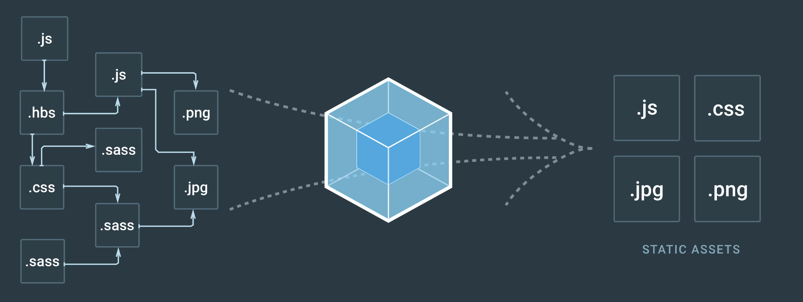

webpack是一个新的前端资源打包工具，它根据你项目里面的依赖关系将所有的资源打包到一个公共的bundle，如下图所示：

```javascript
var webpack = require('webpack');
var HtmlWebpackPlugin = require('html-webpack-plugin');
var ExtractTextPlugin = require('extract-text-webpack-plugin');
var extractLess = new ExtractTextPlugin('app.css');
module.exports = {
  entry: __dirname + '/app/main.js',
  output: {
    path: __dirname + '/public',
    filename: '[name].js'
  },
  module: {
    rules: [
      {
        test: /\.less$/,
        use: extractLess.extract({
          use: [
            {
              loader: 'css-loader',
              options: {
                  modules: true,
                  localIdentName: '[path][name]__[local]--[hash:base64:5]'
              }
            }, {
              loader: 'less-loader'
            }
          ],
          fallback: 'style-loader'
        })
      }, {
        test: /\.js(x)?$/,
        use: [
          {
            loader: 'babel-loader'
          }
        ]
      }, {
        test: /\.(jpe?g|gif|eot|svg|woff|woff2|ttf|png)$/,
        use: [
          {
            loader: 'file-loader',
            options: {
              name: '[name]-[hash:base64:5].[ext]',
              publicPath: '..',
              outputPath: '/src'
            }
          }
        ]
      }, {
        test: /\.art$/,
        use: [
          {
            loader: 'art-template-loader'
          }
        ]
      }, {
        test: require.resolve('jquery'),
        use: [
          {loader:'expose-loader', options: 'jqeury'},
          {loader:'expose-loader', options: 'jQeury'},
          {loader:'expose-loader', options: '$'}
        ]
      }
    ]
  },
  plugins: [
    extrachLess,
    new webpack.HotModuleReplacementPlugin(),
    new webpack.optimize.uglifyJsPlugin(),
    new HtmlWebpackPlugin({
      title: 'document',
      filename: 'index.html',
      template: __dirname + '/app/tpls/index.art',
      favicon: __dirname + '/app/favicon.ico',
      hash: true,
      minify: {
        minifyJS: true,
        minifyCSS: true
      }
    })
  ]
}
```
